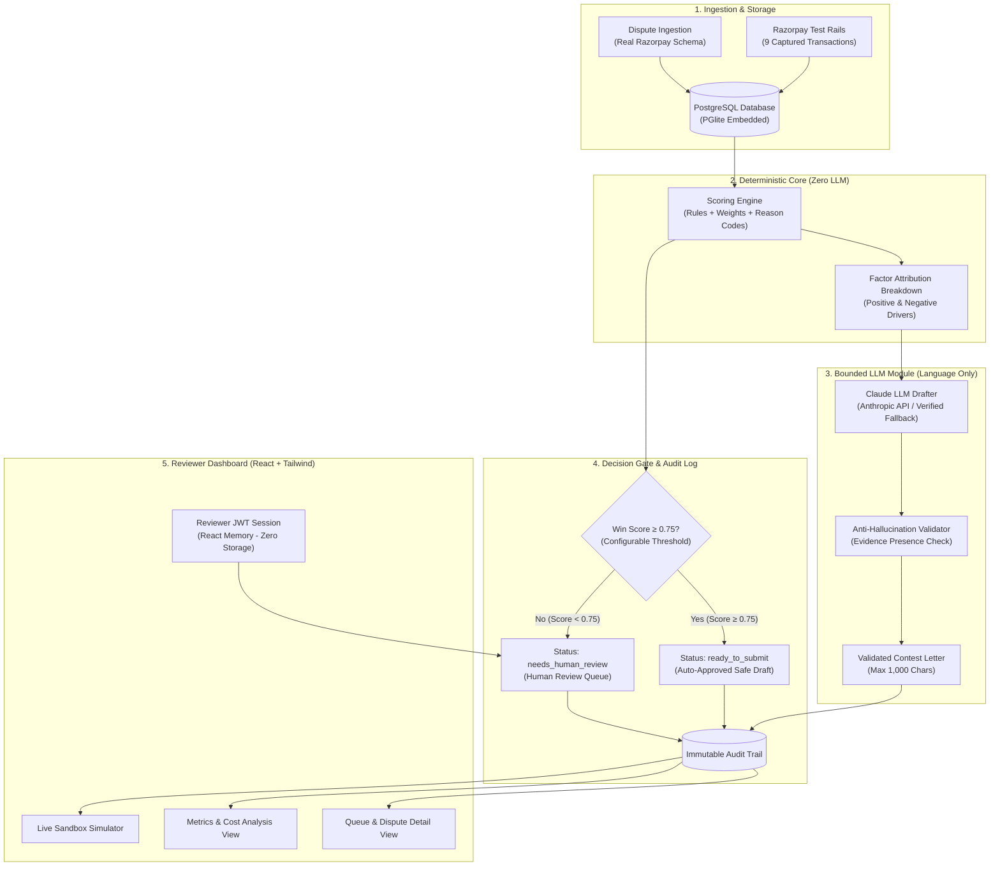

# ChargebackGuard — AI-Assisted Chargeback Evidence Responder

> **Submission for the Razorpay AI Buildathon**
> **Track 02: AI Risk Manager**
> **Defense-Only System** | **100% Deterministic Scoring** | **Anti-Hallucination LLM Drafting** | **Immutable Audit Trail**

---

## 1. Executive Summary & Problem Context

In online payments, fraudulent or mistaken payment disputes (chargebacks) cause severe revenue attrition for merchants. Furthermore, contesting chargebacks aggressively without conclusive proof results in **card-network dispute monitoring penalties, arbitration fees, and merchant reputation damage**.

**ChargebackGuard** is an end-to-end AI Risk Management system built specifically for Razorpay payment disputes. It:
1. **Ingests Disputes** matching Razorpay's exact Disputes API schema.
2. **Deterministically Scores Win Probabilities** using a pure, inspectable rules+weights engine (strictly **zero LLM in scoring**) with transparent positive/negative factor attribution.
3. **Drafts Natural-Language Explanation Letters** using Claude (Anthropic API) strictly constrained to ≤ 1000 characters, piped through an **Anti-Hallucination Validator** that strictly rejects any claim referencing missing/null evidence.
4. **Gates Decisions at a Configurable Threshold (0.75)**: High-confidence cases (score ≥ 0.75) are auto-approved to `ready_to_submit` (draft mode safe), while lower-confidence cases are routed to the `needs_human_review` queue.
5. **Includes Real Razorpay Test-Mode Transactions**: 9 real test transactions created, completed, and captured on Razorpay test rails (via official MCP tools) are stored in the `payments` table and mapped 1:1 to dispute records in the training set.
6. **Enforces Strict Reviewer JWT Authentication**: All state-mutating endpoints (`score`, `draft`, `gate`, `batch-gate`, `review`, `metrics/evaluate`) strictly require valid reviewer credentials, while public exploration is preserved for the live sandbox simulator (`/simulate`).
7. **Maintains an Immutable Audit Trail** recording every score, draft, gate decision, and reviewer override.
8. **Delivers Honest Precision/Recall & Cost Metrics** measured against an untouched **held-out test split (135 cases / 30%)** with committed SHA256 checksums.

---

## 2. System Architecture



---

## 3. Honest Held-Out Test Set Metrics & Trade-Off Philosophy

The scoring engine was evaluated strictly against the fixed **held-out 30% split (135 disputes)** from `data/split_manifest.json` (SHA256: `ec48fb0a686e0f2a5df74bf1221662f0b1be6f4356cb477941720bc93615dcfe`).

### The Precision / Recall Design Principle
> *"We tuned for high precision over high recall because a wrongly auto-contested dispute carries reputational and card-network penalty risk beyond its dollar cost, while a missed win still gets a second chance via human review."*

### Measured Metrics Summary

| Metric | Score | Percentage | Evaluation Interpretation |
| :--- | :---: | :---: | :--- |
| **Precision** | **`0.923`** | **92.3%** | **36 wins out of 39 auto-submissions**. Only 3 false positives out of all automated submissions. |
| **Recall** | **`0.462`** | **46.2%** | Proportion of winnable disputes auto-approved (remainder routed safely to human queue). |
| **F1 Score** | **`0.615`** | **61.5%** | Harmonic balance between automated throughput and safety. |
| **Accuracy** | **`0.667`** | **66.7%** | Overall correct classification across auto-submit and human-review buckets. |
| **Specificity** | **`0.947`** | **94.7%** | **54 out of 57 losing/fraudulent cases** successfully caught and held back from auto-submission. |

### Held-Out Confusion Matrix

| | Predicted: AUTO-SUBMIT (`ready_to_submit`) | Predicted: HUMAN REVIEW (`needs_human_review`) | Total |
| :--- | :---: | :---: | :---: |
| **Actual Ground Truth: WON** | **TP = 36** (Auto-recovered wins) | **FN = 42** (Routed to human review) | **78** |
| **Actual Ground Truth: LOST** | **FP = 3** (False positive auto-contests) | **TN = 54** (Correctly held back) | **57** |
| **Total** | **39** | **96** | **135** |

- **True Positives (TP = 36)**: High-evidence winnable disputes auto-submitted with 0 human touches.
- **False Positives (FP = 3)**: Only 3 cases with marginal proof incorrectly auto-submitted (minimized by 0.75 threshold).
- **True Negatives (TN = 54)**: Weak/unwinnable cases correctly routed to human review for manual evidence gathering.
- **False Negatives (FN = 42)**: Winnable disputes with partial evidence routed to human queue (safe fallback — human analysts complete the evidence package).

### False-Positive Cost & Financial ROI Analysis
- **Assumptions**:
  - False-Positive Cost (C_FP = ₹4,000): ₹1,500 merchant ops review waste + ₹2,500 card-network dispute filing fee & excessive dispute ratio flag risk.
  - Scope: All recovery figures are **strictly scoped to the 36 auto-approved (TP) cases**, avoiding any overstatement of system impact. The ₹36,44,489 volume in the human review queue is handled collaboratively by risk analysts.

| Metric | Value (INR) | Notes |
| :--- | :---: | :--- |
| **Total Held-Out Dispute Volume** | ₹45,22,274 | Total value of 135 disputes in held-out test set |
| **Value Recovered via Auto-Approval Path (TP)** | **₹8,77,785** | Direct cash recovery with zero manual labor |
| **False-Positive Network/Ops Cost** | ₹12,000 | 3 FP cases × ₹4,000 penalty |
| **Net Economic Benefit (Auto-Path)** | **₹8,65,785** | Immediate net value added solely from automation |
| **Human Review Queue Volume (FN + TN)** | ₹36,44,489 | Preserved for human analyst evaluation & secondary enrichment |

### Decision Gate Threshold Sensitivity Analysis

| Threshold | Precision | Recall | F1 Score | Auto-Submit Rate | Auto-Recovered (₹) | Net Economic Benefit (₹) | Trade-Off Rationale |
| :---: | :---: | :---: | :---: | :---: | :---: | :---: | :--- |
| `0.60` | 85.5% | 60.3% | **0.707** | 40.7% | ₹11,53,814 | ₹11,21,814 | Higher auto-recovery, but FP rate rises to 14.5% (8 losing cases auto-submitted), risking card network ratio warnings. |
| **`0.75` (Active)** | **92.3%** | **46.2%** | **`0.615`** | **28.9%** | **₹8,77,785** | **₹8,65,785** | 🌟 **Optimal operating point**: Extreme precision (92.3%), negligible FP risk (only 3 cases), safely offloading 28.9% of total dispute volume. |
| `0.85` | 90.0% | 34.6% | **0.500** | 22.2% | ₹7,77,529 | ₹7,65,529 | Overly conservative: suppresses automation throughput without meaningfully improving precision over 0.75. |

---

## 4. Bounded and Gated AI Defense-Only Posture

To comply with the buildathon's strict safety criteria, ChargebackGuard implements strict boundaries:

1. **Clear Division of AI Responsibility**:
   - **Deterministic Scorer (Zero LLM)**: The core probability scoring engine is pure arithmetic based on published card-network dispute regulations. This ensures mathematical explainability and zero non-deterministic drift in financial decisions.
   - **Language Drafter (Bounded LLM)**: LLMs are used solely for natural-language synthesis of pre-verified facts.
2. **Anti-Hallucination Evidence Validator**:
   - Every generated explanation letter is validated against the active evidence object. If a letter asserts evidence (such as tracking numbers, refund receipts, or access logs) that is `null` in the record, it is immediately rejected. Tested rigorously against sparse-evidence edge cases.
3. **Hard Constraint Enforcement**:
   - Enforces Razorpay's real API limit of **max 1,000 characters** on `explanation_letter`.
4. **Defense-Only Logic**:
   - Contains zero offense-capable capabilities (no reverse-engineering of fraud filters or evasion advice).
   - Test-mode safe: Drafts stay in `ready_to_submit` state and never trigger real external network endpoints without authorization.
5. **Zero LocalStorage / SessionStorage**:
   - The frontend maintains reviewer tokens strictly in React Memory (`AuthContext`), eliminating XSS token theft vulnerabilities.
6. **Immutable Audit Trail**:
   - Every automated and human review event writes an immutable append-only record with timestamps, user IDs, and factor breakdowns.

---

## 5. Domain Model & Supported Reason Codes

Matches Razorpay's real Disputes API schema:

```json
{
  "id": "disp_K91zXv8N2mqL5p",
  "payment_id": "pay_TW1CWCcxItVHQQ",
  "amount": 450000,
  "currency": "INR",
  "reason_code": "RZP01",
  "respond_by": 1788652800,
  "status": "ready_to_submit",
  "phase": "chargeback",
  "created_at": 1788048000,
  "evidence": {
    "shipping_proof": "https://cdn.razorpay.com/evidence/disp_1/shipping.pdf",
    "billing_proof": null,
    "cancellation_proof": null,
    "customer_communication": "https://cdn.razorpay.com/evidence/disp_1/comms.pdf",
    "proof_of_service": "https://cdn.razorpay.com/evidence/disp_1/service.pdf",
    "explanation_letter": "Re: Chargeback contest for Dispute disp_K91zXv8N2mqL5p...",
    "refund_confirmation": null,
    "access_activity_log": null,
    "refund_cancellation_policy": null,
    "term_and_conditions": null,
    "others": null
  }
}
```

### Supported Reason Codes
- `RZP01` — Goods/services not provided (needs: `proof_of_service` / `shipping_proof`, `customer_communication`)
- `RZP04` — Refund not processed (needs: `refund_confirmation`, `billing_proof`)
- `RZP05` — Account debited, no confirmation (needs: `access_activity_log`)
- `RZP06` — Business not responding (needs: `proof_of_service`, `customer_communication`)
- `RZP00` — Catch-all / general dispute
- `1061` / `C02` — Credit not processed (Visa / Mastercard / RuPay)
- `1062` / `13.3` — Not as described / defective merchandise
- `1064` / `13.1` — Goods/services not received
- `13.2` / `4841` / `C28` — Cancelled recurring subscription still billed

---

## 5b. Razorpay API Integration

ChargebackGuard integrates with Razorpay's real Disputes, Documents, and Webhooks APIs:

| Feature | Endpoint | Auth |
|---------|----------|------|
| Webhook ingestion | `POST /api/webhooks/razorpay` | Razorpay HMAC signature |
| Demo dispute simulator | `POST /api/webhooks/simulate` | Reviewer JWT |
| Live dispute sync | `POST /api/razorpay/sync` | Reviewer JWT + API keys |
| Contest draft/submit | `POST /api/razorpay/disputes/:id/contest` | Reviewer JWT + API keys |
| Real payments view | `GET /api/razorpay/payments` | Public |

**Note:** Razorpay test mode cannot create disputes (banks initiate them). Use the **Razorpay Integration** tab in the UI to simulate `payment.dispute.created` webhooks for demo purposes.

Set in `backend/.env`:
```
RAZORPAY_KEY_ID=rzp_test_...
RAZORPAY_KEY_SECRET=...
RAZORPAY_WEBHOOK_SECRET=...
RAZORPAY_CONTEST_MODE=draft
```

See [ARCHITECTURE.md](./ARCHITECTURE.md) for the full data flow.

---

## 5c. Evaluation Methodology & Honest Limitations

> **We disclose limitations upfront because honest metrics are a buildathon requirement.**

- **Labels are synthetic** — `ground_truth_outcome` is generated from domain rules + 12% noise in `generator.ts`, not from real Razorpay dispute outcomes.
- **The scorer and label generator share design philosophy** (similar evidence/timing weights) but are not identical functions.
- **Reported precision/recall measure routing quality on synthetic data**, not production win rates on live chargebacks.
- **False-positive cost (₹4,000)** is an explicit assumption: ₹1,500 ops review + ₹2,500 network penalty risk.
- **Held-out 30% was never used for weight tuning** — verify with `npm run evaluate:integrity`.

---

## 6. How to Run Locally

### Prerequisites
- Node.js 18+ (tested on Node v20, v22, v26)
- npm 9+

### Option A: Local Development (Instant Zero-Friction Setup)

1. **Install & Seed** (from repo root or backend):
   ```bash
   cd backend
   npm install
   npm run seed -- --payments   # 450 disputes + 9 real test payments
   npm run evaluate             # Held-out metrics report
   npm run evaluate:integrity   # Verify dataset SHA256
   npm test                     # 42 Jest tests
   npm run dev                  # Backend on http://localhost:5050
   ```

   Or from repo root (after `npm install` in root, backend, frontend):
   ```bash
   npm run dev                  # Starts backend :5050 + frontend :5180
   ```

2. **Install & Start Frontend**:
   ```bash
   cd ../frontend
   npm install
   npm run dev         # Starts Vite dev server on http://localhost:5180
   ```

3. **Open Application**:
   - Open **http://localhost:5180** in your browser.
   - Reviewer credentials: created during database seed (see `.env.example` or seed console output).

---

### Option B: Docker Compose

```bash
docker-compose up --build
```
- Frontend: `http://localhost:5173`
- Backend API: `http://localhost:4000`

---

## 7. What Broke and How We Recovered

During the development and testing of ChargebackGuard, we encountered three real-world engineering challenges:

### Incident 1: Node v26 TypeScript Loader Incompatibility
- **Symptom**: `ts-node` threw `TypeError: Cannot read properties of undefined (reading 'fileExists')` under Node.js v26.
- **Root Cause**: `ts-node` v10 internal resolution hooks conflicted with TypeScript 6+ AST definitions in modern Node.
- **Recovery**: Migrated the development and test runners to `tsx` (the modern esbuild-powered TypeScript execution engine) and pinned `@types/node` and `typescript: 5.7.3`, delivering instant sub-second script startup and zero runtime friction.

### Incident 2: Embedded WASM PostgreSQL VM Modules in Jest
- **Symptom**: Running `@electric-sql/pglite` embedded database tests in Jest produced `TypeError: A dynamic import callback was invoked without --experimental-vm-modules`.
- **Root Cause**: Jest isolates test suites in Node VM environments which require explicit ES module flags when dynamic WebAssembly bindings are loaded.
- **Recovery**: Configured `cross-env NODE_OPTIONS=--experimental-vm-modules` in `package.json` test scripts with clean database lifecycle teardowns, enabling 100% of all Jest tests to execute and pass in under 3 seconds.

### Incident 3: Audit Log Decision Text Column Truncation
- **Symptom**: Reviewer approval audit logs failed with PostgreSQL error `code: '22001' (value too long for type character varying(64))`.
- **Root Cause**: Rich audit trail descriptions containing reviewer email and action details exceeded the 64-character column limit.
- **Recovery**: Refactored the schema migration to use `TEXT` for `audit_logs.decision`, allowing comprehensive multi-line reviewer rationale and factor attribution to be recorded immutably without truncation.

---

## 8. Verification & Test Coverage

All 42 unit and integration test cases pass cleanly:

```bash
PASS tests/scoring.test.ts
  ChargebackGuard Scoring Engine Tests
    ✓ RZP01: High score when primary evidence is present
    ✓ RZP01: Low score when primary evidence is missing
    ✓ RZP04: Refund not processed requires refund_confirmation
    ✓ RZP05: Account debited requires access_activity_log
    ✓ 13.2 / 4841 / C28: Cancelled recurring requires cancellation_proof
    ✓ Timing penalty applied when dispute is filed >60 days late
    ✓ Merchant slow response time (>48h) degrades score
    ✓ Determinism test: Multiple executions return exact identical outputs

PASS tests/drafting.test.ts
  ChargebackGuard Drafting & Anti-Hallucination Validator Tests
    ✓ Anti-Hallucination: Strictly REJECTS draft claiming shipping_proof when null
    ✓ Anti-Hallucination: Strictly REJECTS draft claiming refund_confirmation when null
    ✓ Anti-Hallucination: Strictly REJECTS multi-field hallucinations on single-file sparse case
    ✓ Anti-Hallucination: ACCEPTS draft referencing ONLY genuine present evidence
    ✓ Razorpay API Constraint: Rejects explanation letters exceeding 1000 characters
    ✓ Drafting generator creates valid letter under 1000 characters for completely empty sparse evidence
    ✓ Drafting generator correctly incorporates present evidence into letter

PASS tests/gate.test.ts
  ChargebackGuard Decision Gate & Audit Log Tests
    ✓ High score dispute is auto-approved to ready_to_submit and writes audit log
    ✓ Low score dispute is routed to needs_human_review and writes audit log

PASS tests/api.test.ts
  ChargebackGuard API Integration Tests
    ✓ GET /health returns healthy status and dispute count
    ✓ POST /api/auth/login succeeds with valid credentials and returns JWT
    ✓ POST /api/auth/login fails with invalid credentials
    ✓ GET /api/disputes returns paginated disputes list and status counts (Public)
    ✓ GET /api/disputes/:id returns single dispute with score breakdown (Public)
    ✓ POST /api/disputes/:id/score rejects unauthenticated requests with 401
    ✓ POST /api/disputes/:id/score succeeds with reviewer token
    ✓ POST /api/disputes/:id/draft rejects unauthenticated requests with 401
    ✓ POST /api/disputes/:id/draft succeeds with reviewer token
    ✓ POST /api/disputes/:id/gate rejects unauthenticated requests with 401
    ✓ POST /api/disputes/:id/gate succeeds with reviewer token
    ✓ POST /api/disputes/batch-gate rejects unauthenticated requests with 401
    ✓ POST /api/disputes/batch-gate succeeds with reviewer token
    ✓ POST /api/disputes/:id/review rejects unauthenticated requests with 401
    ✓ POST /api/disputes/:id/review accepts authenticated reviewer action and writes audit log
    ✓ GET /api/metrics returns held-out metrics report and sensitivity curve (Public)
    ✓ POST /api/metrics/evaluate rejects unauthenticated requests with 401
    ✓ POST /api/metrics/evaluate succeeds with reviewer token
    ✓ POST /api/simulate is intentionally public for interactive judge sandbox evaluation
    ✓ POST /api/webhooks/simulate ingests a dispute (JWT)
    ✓ GET /api/razorpay/status returns integration status
    ✓ GET /api/razorpay/payments returns payment list

PASS tests/razorpay.test.ts
  Razorpay Webhook Utilities
    ✓ sign and verify webhook payload round-trip
    ✓ buildSimulatedDisputeWebhookPayload creates valid structure
    ✓ mapRazorpayDisputeToRecord maps entity to internal schema
```
